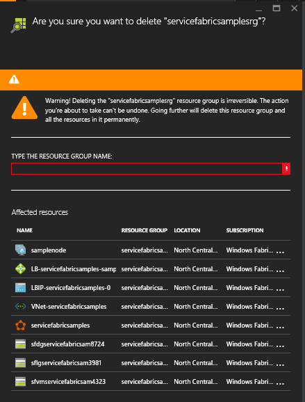

## Cleanup Azure Subscription

Your Free Azure Subscription offers *$200* in Azure Credit for 30 days. To help you make best use of this credit, we will cleanup resource groups used in our hands-on exercises today.

### Delete a Resource Group

Deleting a resource group deletes all the resources contained within it. You can also delete individual resources within a resource group. You want to exercise caution when you delete a resource group because there might be resources in other resource groups that are linked to it.

1. To see all the resource groups in your subscription, select **Resource groups**.

	

1. Select one of the **Resource Groups** you created during the hands-on exercises today.

1. To quickly access this resource group again, you can pin the *Resource Group* blade to your dashboard.

	

1. Click the **Delete** button at the top of the resource group to delete the entire group and all of it's resources.

1. In the *confirmation* blade, enter the name of the resource group again and click the **Delete** button.

	

1. Repeat these steps for every **Resource Group** created in this workshop. The names of the various resource groups used in the hands-on exercises are included below for your reference:

	- ``CapitalOneWITVM``
	- ``CapitalOneWITBot``
	- ``CapitalOneWITCognitive``
	- ``CapitalOneWITAutomation``

> **Congratulations!** You have completed all of the exercises for today.
